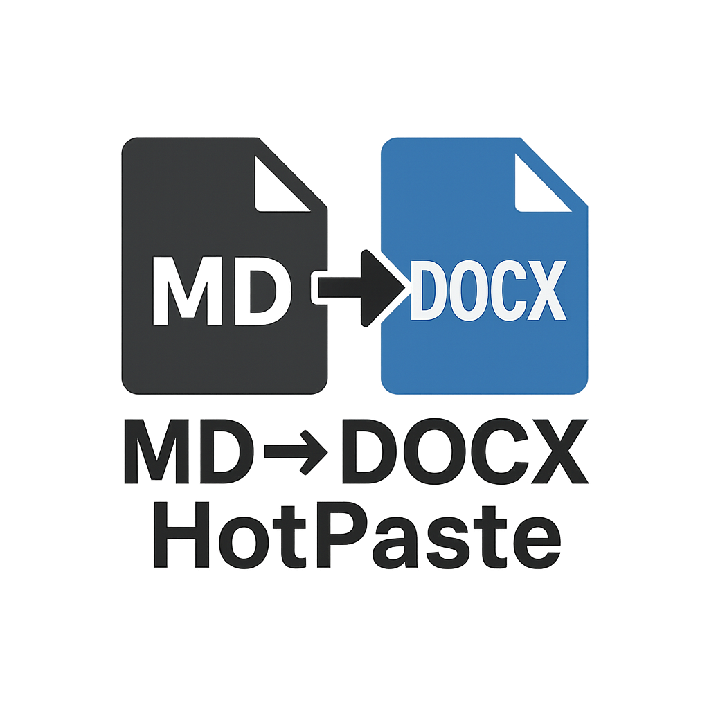
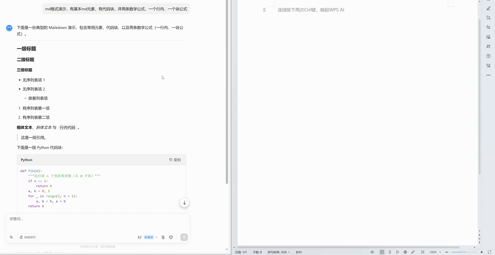

# MD2DOCX HotPaste
<p align="center">
  
</p>

一个常驻托盘的小工具：
从 **剪贴板读取 Markdown**，调用 **Pandoc** 转换为 DOCX，并自动插入到 **Word/WPS** 光标位置。

---

## 功能特点

### 演示效果

<p align="center">
  
</p>

* 全局热键（默认 `Ctrl+B`）一键粘贴 Markdown → DOCX。
* 自动识别当前前台应用：Word 或 WPS。
* 托盘菜单，可切换目标、保留文件、查看日志/配置等。
* 支持系统通知提醒。
* 无黑框，无阻塞，稳定运行。

---

## 🚀使用方法

1. 下载可执行文件（[Releases 页面](https://github.com/RICHQAQ/md2docx_hotpaste/releases/)）：

   * **MD2DOCX-HotPaste\_vx.x.x.exe**：**便携版**，需要你本机已经安装好 **Pandoc** 并能在命令行运行。
   若未安装，请到 [Pandoc 官网](https://pandoc.org/installing.html) 下载安装即可。
   * **MD2DOCX-HotPaste\_pandoc-Setup.exe**：**一体化安装包**，自带 Pandoc，不需要另外配置环境。

2. 打开 Word 或 WPS，光标放在需要插入的位置。

3. 复制 Markdown 到剪贴板，按下热键 **Ctrl+B**。

4. 转换结果会自动插入到文档中，并在右下角提示成功/失败。

---

## ⚙️配置

首次运行会生成 `config.json`，可手动编辑：

```json
{
  "hotkey": "<ctrl>+b",
  "pandoc_path": "pandoc",
  "reference_docx": null,
  "save_dir": "%USERPROFILE%\\Documents\\md2docx_paste",
  "keep_file": false,
  "insert_target": "auto",
  "notify": true
}
```

字段说明：

* `hotkey`：全局热键，语法如 `<ctrl>+<alt>+v`。
* `pandoc_path`：Pandoc 可执行文件路径。
* `save_dir`：保留文件时的保存目录。
* `keep_file`：是否保留生成的 DOCX 文件。
* `insert_target`：插入目标，可选 `auto` / `word` / `wps` / `none`。
* `notify`：是否显示系统通知。

修改后可在托盘菜单选择 **“重载配置/热键”** 立即生效。

---

## 托盘菜单

* **启用热键**：开/关全局热键。
* **插入目标**：切换为 Auto/Word/WPS/None。
* **保留生成文件**：勾选后，文件保存在 `save_dir`。
* **打开保存目录**、**查看日志**、**编辑配置**、**重载配置/热键**、**退出**。

---

## 📦从源码运行 / 打包

建议 Python 3.11 (64位，和 Office/WPS 位数一致)。

```bash
pip install psutil pyperclip pynput pystray pillow plyer pywin32
python main.py
```

使用 PyInstaller：

```bash
pyinstaller --clean -F -w -n MD2DOCX-HotPaste  --icon assets\icons\logo.ico  --add-data "assets\icons;assets\icons" --hidden-import plyer.platforms.win.notification  main.py
```

生成的程序在 `dist/MD2DOCX-HotPaste.exe`。

---

## License

This project is licensed under the [MIT License](LICENSE).